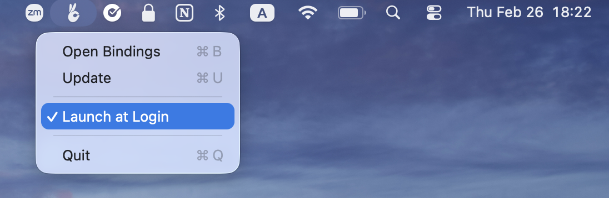

<p align="center">
  
</p>

<h3 align="center">Lolabunny</h3>


Lightweight local command router that lets you navigate apps, tools, and internal resources directly from your browser address bar.

## Nah, why do I need another bookmark app? 

I tried options like native browser bookmarks and tools like Yubnub, but nothing really fit my workflow and after years of using a [similar system](https://www.quora.com/What-is-Facebooks-bunnylol) internally at Facebook, I couldn’t imagine working without it. So I built Lolabunny, inspired by [bunnylol.rs](https://github.com/facebook/bunnylol.rs) by Aaron Lichtman and Joe Previte, with a focus on simplicity and zero-friction setup.

## How to install

### Apple Silicon

📦 You can [download](https://github.com/sidosera/lolabunny.app/releases) pre-built release.

🍺 Or using Homebrew

```sh
brew install --cask bunnylol
brew tap sidosera/lolacore
brew install lola-core
```

🛠️ Or build from source

```sh
git clone https://github.com/sidosera/lolabunny.app.git && cd lolabunny.app
cargo xtask bundle && cp -r target/Bunnylol.app /Applications/
```


## Updates (local-first)

Lolabunny is local-first:

- App and server always launch from local binaries/cache.
- Network is not required for normal usage.

Update behavior:

- The macOS app checks for server updates in the background about once per day.
- If a newer compatible server version exists, the app downloads it in the background (skipped in Low Power Mode).
- After download, the app sends a notification asking permission to apply the update.

Server cache is stored under:

```sh
$XDG_DATA_HOME/bunnylol/servers
# or ~/.local/share/bunnylol/servers
```


## The only configuration


🔖 Allow Lolabunny app installation from third party developers

```
xattr -cr /Applications/Lolabunny.app
```

🔖 Add to "Launch at Login"

<p align="center">
  
</p>


🔖 Set your browser search engine to:

```
http://localhost:8085/?cmd=%s
```

E.g. for [Chrome](https://support.google.com/chrome/answer/95426).

## Plugins

Commands (or plugins) are Lua scripts stored at:

```
~/.local/share/bunnylol/commands/
```

It can be installed like:

```sh
brew install lola-core
```


## Config

```
~/.config/bunnylol/config.toml
```

```toml
default_search = "google"

[server]
port = 8085
```


## License

MIT

